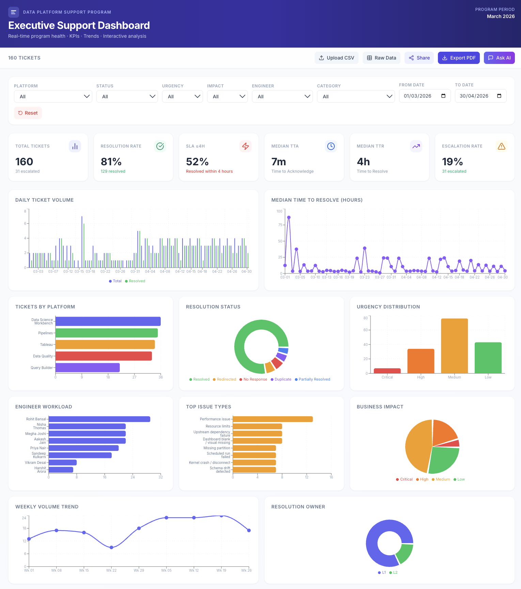
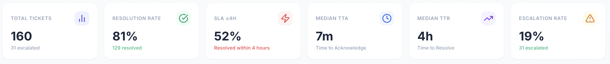
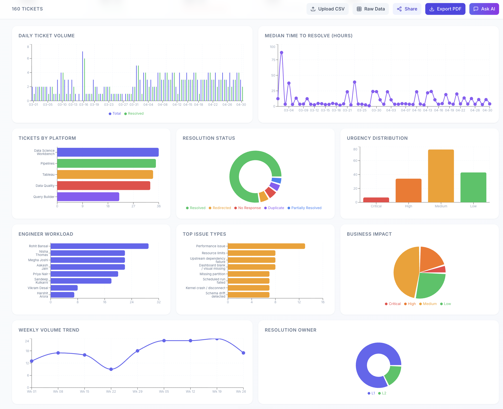
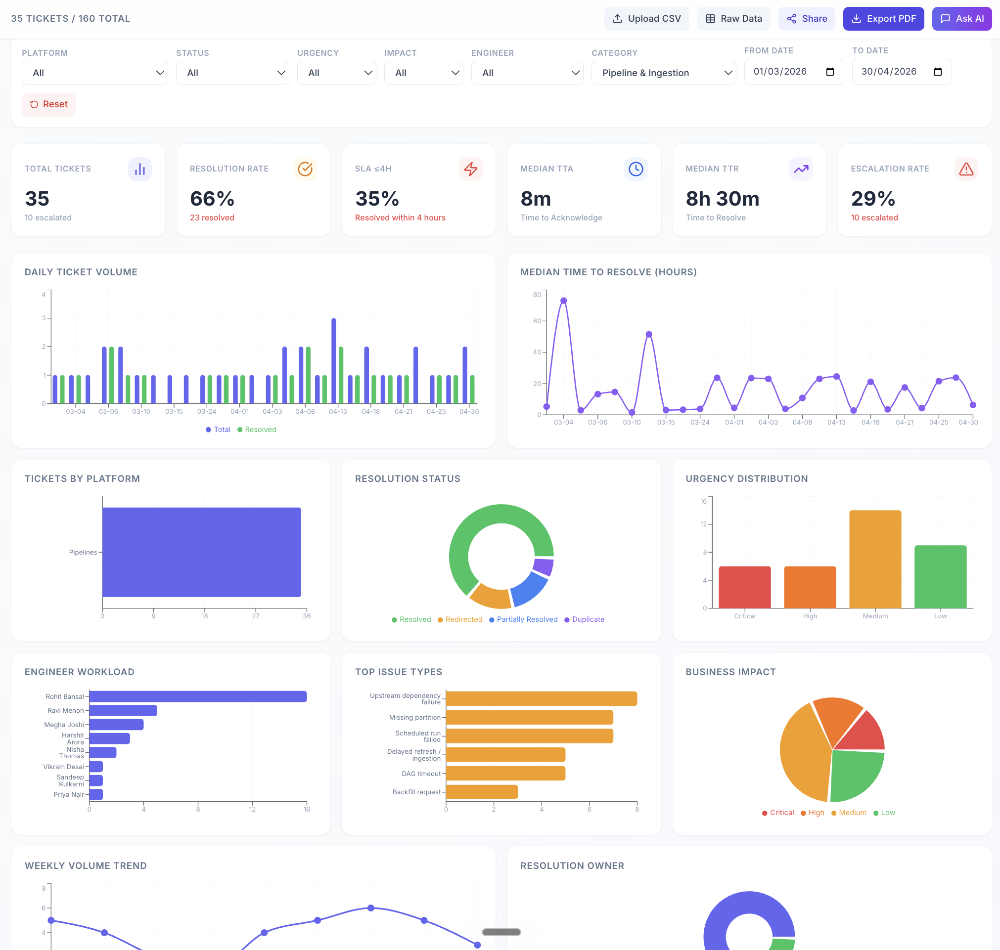
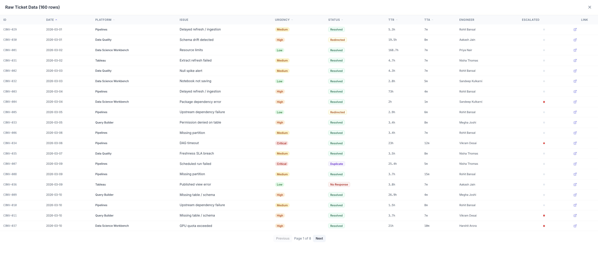

# AI Support Intelligence Dashboard

> A real-time, interactive web dashboard that transforms raw support ticket data into executive-ready KPIs, trend analysis, and AI-powered insights — built for data platform support operations.

---

## The Business Problem

Support managers and program leads across data platform teams lack real-time visibility into how support is performing. Questions like *"Which platform generates the most critical escalations?"*, *"Are we meeting SLA targets?"*, or *"Which engineer is overloaded?"* typically require manual data pulls and spreadsheet work.

This dashboard answers those questions instantly — with filters, charts, and an AI assistant that responds to plain English queries about the data.

---

## What This Project Demonstrates

| Capability | Detail |
|---|---|
| **Full-stack development** | Next.js 15 (App Router), TypeScript, React, Tailwind CSS |
| **Data engineering** | CSV ingestion → schema detection → structured metrics computation |
| **Data visualisation** | Interactive charts: volume trends, TTR trends, platform breakdown, urgency distribution, engineer workload |
| **AI integration** | GPT-4o-mini chatbot for natural language queries over ticket data |
| **Operational KPIs** | Resolution rate, escalation rate, SLA ≤4h, Median TTA, Median TTR |
| **Schema flexibility** | Upload any CSV — the app detects and reconciles column mismatches |
| **Export & sharing** | PDF export, view-only shareable URL |

---

## Key Features

- **160 realistic support tickets** across March–April 2026, spanning 5 platforms and 5 issue categories
- **KPI grid** — Total Tickets, Resolution Rate, SLA ≤4h compliance, Median Time-to-Acknowledge, Median Time-to-Resolve, Escalation Rate
- **Interactive filters** — Platform, Status, Urgency, Business Impact, Engineer, Category, Date Range
- **Charts** — Daily ticket volume, TTR trend, tickets by platform, resolution status, urgency distribution, engineer workload, weekly trend
- **Ask AI** — Type plain English questions like *"How many critical tickets were escalated in April?"*
- **Upload your own CSV** — Smart schema reconciliation maps your columns to the expected format
- **Export PDF** — One-click dashboard snapshot
- **View-only mode** — Share a read-only link with stakeholders at `/view`

---

## Dashboard Screenshots

> 📸 *Add screenshots here after running the app locally. See [Screenshots Guide](#screenshots-guide) below.*

| Overview | KPI Metrics | Charts |
|---|---|---|
|  |  |  |

| Category Filter | Raw Data Table |
|---|---|
|  |  |

---

## Tech Stack

| Layer | Technology |
|---|---|
| Framework | [Next.js 15](https://nextjs.org/) (App Router) |
| Language | TypeScript |
| Styling | [Tailwind CSS](https://tailwindcss.com/) |
| Charts | [Recharts](https://recharts.org/) |
| CSV Parsing | [PapaParse](https://www.papaparse.com/) |
| AI / LLM | GPT-4o-mini via LLM API proxy |
| PDF Export | [jsPDF](https://github.com/parallax/jsPDF) + [html2canvas](https://html2canvas.hertzen.com/) |
| Icons | [Lucide React](https://lucide.dev/) |

---

## Folder Structure

```
├── public/
│   ├── raw_support_threads.csv     # 160 synthetic support tickets (the dataset)
│   └── favicon.svg
├── screenshots/                    # Dashboard screenshots for README
├── src/
│   ├── app/
│   │   ├── layout.tsx              # App shell & metadata
│   │   ├── page.tsx                # Main dashboard route (/)
│   │   ├── view/
│   │   │   └── page.tsx            # View-only route (/view)
│   │   └── api/
│   │       └── chat/
│   │           └── route.ts        # AI chatbot API endpoint
│   ├── components/
│   │   ├── Dashboard.tsx           # Main dashboard shell + state management
│   │   ├── Header.tsx              # Top navigation header
│   │   ├── FiltersBar.tsx          # Filter controls (platform, category, date...)
│   │   ├── KPIGrid.tsx             # KPI metric cards
│   │   ├── ChartsSection.tsx       # All chart visualisations
│   │   ├── TicketTable.tsx         # Raw ticket data table
│   │   ├── ChatBot.tsx             # AI chat interface
│   │   ├── SchemaReconciliation.tsx# CSV column mapping UI
│   │   └── ViewOnlyDashboard.tsx   # Simplified read-only dashboard
│   └── lib/
│       ├── csvParser.ts            # CSV parsing, schema detection, column mapping
│       ├── metrics.ts              # KPI & chart data computation
│       └── llm-client.ts          # LLM API client wrapper
├── .env.example                    # Environment variable template
├── next.config.js                  # Next.js configuration
├── tailwind.config.js              # Tailwind configuration
├── tsconfig.json                   # TypeScript configuration
└── package.json                    # Dependencies and scripts
```

---

## How to Run Locally

### Prerequisites
- [Node.js 18+](https://nodejs.org/) (LTS recommended)
- A terminal (macOS Terminal, iTerm2, VS Code terminal)

### Steps

```bash
# 1. Clone the repository
git clone https://github.com/tegbhattiitk/ai-support-intelligence.git
cd ai-support-intelligence

# 2. Install dependencies
npm install

# 3. (Optional) Set up environment variables for AI chat
cp .env.example .env.local
# Edit .env.local and add your LLM_API_KEY
# The dashboard works fully without this — only the "Ask AI" feature needs it

# 4. Start the development server
npm run dev
```

Open [http://localhost:3000](http://localhost:3000) in your browser.

> **Note:** The full dashboard — KPIs, charts, filters, PDF export, CSV upload — works without any API key. Only the "Ask AI" chatbot requires a valid `LLM_API_KEY` (compatible with OpenAI-format APIs).

---

## How to Test the Project

Once the app is running at `http://localhost:3000`, try the following:

1. **Filter by Category** — Use the Category dropdown to show only `Pipeline & Ingestion` tickets. Watch KPIs and charts update in real time.
2. **Filter by Platform** — Select `Tableau` and see its specific metrics.
3. **Apply a date range** — Set From Date to `2026-04-01` to see April-only data.
4. **View Raw Data** — Click the "Raw Data" button to browse all 160 tickets in a table.
5. **Export PDF** — Click "Export PDF" and download a snapshot of the current dashboard view.
6. **Upload a custom CSV** — Click "Upload CSV" and upload any support data CSV. The app will detect your columns and walk you through mapping them.
7. **Ask AI** — Click "Ask AI" and type: *"Which platform had the most escalations?"* or *"What is the SLA compliance rate?"* (requires API key)
8. **View-only mode** — Visit [http://localhost:3000/view](http://localhost:3000/view) to see the shareable read-only dashboard.

---

## Sample Use Cases

- *"Show me all Critical urgency tickets in the Data Quality category"*
- *"What is the resolution rate for Tableau tickets in April 2026?"*
- *"Which engineers handled the most escalated tickets?"*
- *"Filter to unresolved Pipeline & Ingestion tickets — how many are there?"*
- *"Export a PDF snapshot of this week's support health for the executive review"*

---

## Relevance: Program Management / AI Operations / Support Intelligence

This project directly mirrors real-world challenges in support operations and AI-enabled program management:

- **Support KPI frameworks** — Resolution rate, SLA ≤4h, TTA, TTR, escalation rate are standard metrics used in enterprise support reviews
- **Data-driven decisions** — Filters and trend charts make it possible to spot patterns (e.g. spikes in Tableau performance issues, Pipeline DAG failures clustering on Mondays)
- **AI augmentation** — The chatbot layer demonstrates how LLMs can answer operational questions without requiring SQL knowledge
- **Cross-functional visibility** — The shareable `/view` route mirrors how program managers share dashboards with leadership
- **Schema flexibility** — The CSV upload + reconciliation feature reflects real-world data inconsistency challenges when integrating multiple support tools

---

## The Dataset

The `public/raw_support_threads.csv` file contains **160 synthetic support tickets** with the following structure:

| Field | Description |
|---|---|
| `conversation_id` | Unique ticket ID (CONV-001 to CONV-160) |
| `platform_name` | Data Science Workbench, Pipelines, Data Quality, Query Builder, Tableau |
| `ticket_title` | Issue type (e.g. Resource limits, DAG timeout, Schema drift detected) |
| `category` | Infrastructure / Pipeline & Ingestion / Data Quality / Access & Permissions / Reporting & Visualization |
| `urgency_level` | Critical / High / Medium / Low |
| `business_impact_level` | Critical / High / Medium / Low |
| `resolution_status` | Resolved / Redirected / No Response / Duplicate / Partially Resolved |
| `first_message_timestamp` | When the ticket was raised |
| `acknowledgment_timestamp` | When an engineer first responded |
| `resolution_timestamp` | When the ticket was closed |
| `was_escalated` | Yes / No |
| `resolving_engineer_name` | Engineer who resolved the ticket |

All data is **fully synthetic** — names, timestamps, and Slack links are fabricated for demonstration purposes.

---

## Future Improvements

- [ ] Real Slack / Jira / Zendesk API integration to replace synthetic data
- [ ] Automated anomaly detection (e.g. alert when escalation rate spikes)
- [ ] ML-based ticket categorisation on upload
- [ ] Multi-team and multi-organisation support
- [ ] Role-based access control (engineer vs executive view)
- [ ] Real-time data refresh via WebSocket or polling
- [ ] Email digest / scheduled reporting

---

## Screenshots Guide

Take these screenshots from `http://localhost:3000` and save them to a `screenshots/` folder in the project root:

| Filename | What to capture |
|---|---|
| `01_dashboard_overview.png` | Full page — header, KPI cards, and top of charts all visible |
| `02_kpi_metrics.png` | Close-up of the 6 KPI cards |
| `03_charts_section.png` | Charts section — Daily Volume + TTR Trend |
| `04_category_filter.png` | Category filter set to "Pipeline & Ingestion" — showing filtered count + updated charts |
| `05_raw_data_table.png` | Raw Data drawer open showing the ticket table |

**Optional GIF demo (20–30 seconds):**
Record this flow using a tool like [Kap](https://getkap.co/) (free, Mac):
1. Open the dashboard — KPIs and charts visible
2. Scroll down through charts
3. Apply Platform filter → Tableau
4. Apply Category filter → Reporting & Visualization
5. Click "Raw Data" → show ticket table briefly
6. Click "Export PDF"

---

## Author

**Teg Partap Bhatti**
- GitHub: [@tegbhattiiitk](https://github.com/tegbhattiiitk)
- Project type: Public portfolio project — AI / Data / Program Management

---

*This project is built for demonstration and portfolio purposes. All support ticket data is fully synthetic.*
